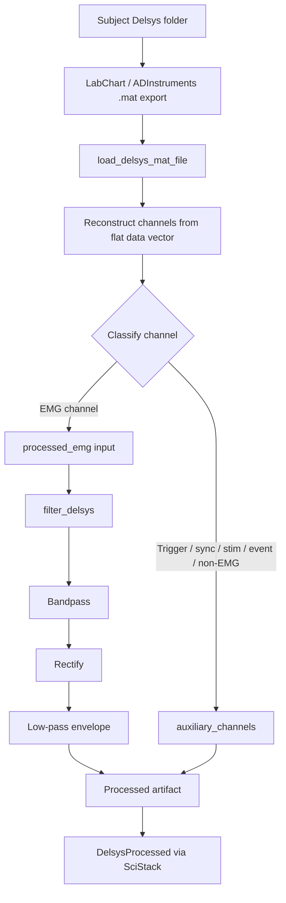
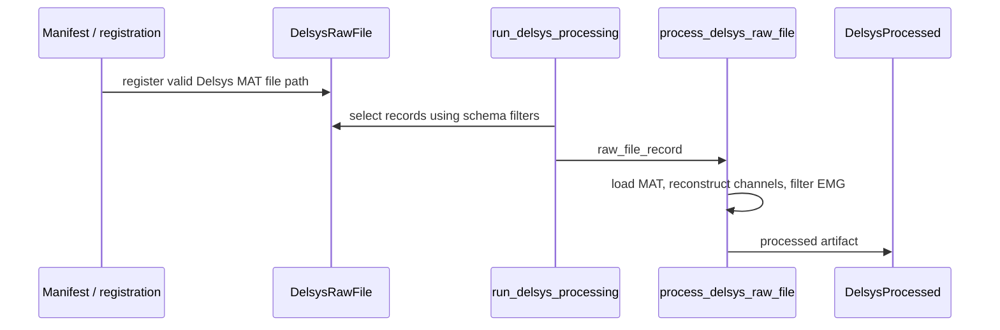
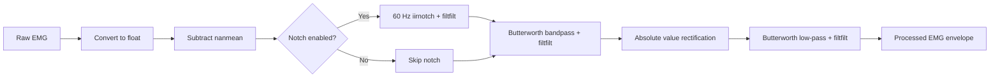

# Delsys Modality Pipeline

Last updated: 2026-07-06  
Pipeline status: MAT export loading, EMG filtering, auxiliary-channel preservation, and SciStack stage wiring are implemented.

## Executive Summary

The Delsys modality pipeline converts LabChart/ADInstruments MATLAB exports from Delsys EMG collection into processed EMG envelopes that can be stored through the project SciStack/SciDB workflow.

The current input target is `.mat`, not `.adicht`. The `.adicht` files remain acquisition/source files, while the `.mat` files are the pipeline-readable exports.

The loader is channel-count dynamic. It does not assume 10, 11, or 12 channels. It reads the channel count from the MAT metadata arrays and reconstructs every channel present in the file.

Current behavior:

- Loads ADInstruments-style MAT exports with flat `data` plus channel spans.
- Reconstructs each channel from `datastart` and `dataend`.
- Dynamically separates EMG channels from auxiliary channels.
- Filters EMG channels only.
- Preserves trigger/stim/sync/event channels unfiltered.
- Runs as a SciStack stage from `DelsysRawFile` to `DelsysProcessed`.
- Also supports direct file-path calls for debugging and one-off validation.

## Repository Files

| File | Role |
| --- | --- |
| `delsys_pipeline.py` | SciStack stage wrapper. Registers `process_delsys_raw_file()` as the processing function for `DelsysRawFile -> DelsysProcessed`. |
| `process_delsys.py` | MAT loader, channel reconstruction, channel classification, raw-file record handling, and processed artifact assembly. |
| `delsys_filtering.py` | Signal-processing functions for EMG filtering. |
| `delsys_config.json` | Modality-specific sampling and filter settings. |
| `README.md` | This document. |

## Data Flow



## SciStack Integration

Yes, this modality uses SciStack.

`delsys_pipeline.py` exposes:

```python
def run_delsys_processing(**schema_filters):
    return run_scistack_stage(
        process_delsys_raw_file,
        inputs={"raw_file_record": DelsysRawFile},
        outputs=[DelsysProcessed],
        schema_filters=schema_filters,
    )
```

The normal production flow is:



SciStack-facing table classes live in `Modality_Pipelines/common/scidb_tables.py`:

- Input: `DelsysRawFile`
- Output: `DelsysProcessed`

The direct call path is still supported for debugging:

```python
from Modality_Pipelines.Delsys_Pipeline.process_delsys import process_delsys_raw_file

result = process_delsys_raw_file(r"path\to\file.mat")
```

## MAT Export Contract

The loader expects an ADInstruments/LabChart MATLAB export with these keys:

| Key | Required | Meaning |
| --- | --- | --- |
| `data` | Yes | One flat vector containing all channels concatenated together. |
| `datastart` | Yes | One-based inclusive start index for each channel inside `data`. |
| `dataend` | Yes | One-based inclusive end index for each channel inside `data`. |
| `titles` | Yes | Channel labels. Export padding is stripped. |
| `samplerate` | Yes | Sampling rate per channel. |
| `unittext` | No, but expected | Unit label lookup table, such as `mV` and `V`. |
| `unittextmap` | No, but expected | One-based unit lookup index per channel. |
| `tickrate` | No | Acquisition timing metadata. |
| `blocktimes` | No | Acquisition block timing metadata. |
| `firstsampleoffset` | No | Per-channel sample offset metadata. |

Important indexing detail: `datastart` and `dataend` are treated as MATLAB-style one-based inclusive indices. Python slicing is therefore `data[start - 1:end]`.

## Dynamic Channel Handling

The loader is intentionally dynamic for new Delsys files with 12 channels or other future channel counts.

It derives channel count from the metadata arrays:

```text
len(titles) == len(datastart) == len(dataend) == len(samplerate)
```

Then it reconstructs every channel. No hard-coded channel count is used.

Channel classification is currently rule-based:

- A channel is auxiliary if its name contains one of: `trig`, `trigger`, `sync`, `stim`, `event`.
- A channel is EMG if it is not auxiliary and its unit is empty or mV-like.
- Any channel not classified as EMG is preserved in `auxiliary_channels`.

For known 12-channel exports, this should work if the new channels are either normal mV EMG channels or clearly named auxiliary channels. If a new non-EMG channel has `mV` units and a generic label, add its identifying keyword to `NON_EMG_CHANNEL_KEYWORDS` or move channel classification into config.

## Output Artifact Contract

`process_delsys_raw_file()` returns a dictionary:

```python
{
    "file_path": str,
    "sampling_frequency": float,
    "processed_emg": dict[str, np.ndarray],
    "auxiliary_channels": dict[str, np.ndarray],
    "metadata": dict,
}
```

`processed_emg` contains filtered EMG envelopes keyed by channel name.

`auxiliary_channels` contains unfiltered channels such as `Stim Trig`.

`metadata` contains:

- `channel_names`
- `emg_channel_names`
- `auxiliary_channel_names`
- `samplerate_by_channel`
- `unit_by_channel`
- `tickrate`
- `blocktimes`
- `firstsampleoffset`
- `sample_count_by_channel`
- `filter`
- `pipeline_metadata`

## Filtering Details

Configured in `delsys_config.json`:

| Setting | Value |
| --- | --- |
| EMG sampling frequency | 2000 Hz |
| Bandpass order | 4 |
| Bandpass cutoff | 4-100 Hz |
| Low-pass order | 2 |
| Low-pass cutoff | 5 Hz |
| Notch filter | Disabled by default |
| Notch frequency | 60 Hz when enabled |
| Notch quality factor | 30 when enabled |

Filtering flow per EMG channel:



All-NaN channels are returned as all NaN. Normal channels are expected to produce finite arrays.

## Explanation for a Software Engineer

Think of this modality as three layers:

1. IO and export parsing in `process_delsys.py`.
2. Signal processing in `delsys_filtering.py`.
3. Pipeline orchestration in `delsys_pipeline.py`.

The core technical hazard is the MAT export layout. The data are not stored as a clean 2D matrix. They are stored as one flat vector, with channel spans in `datastart` and `dataend`. The loader reconstructs a dict of channel arrays using those spans.

The second hazard is channel classification. We do not want to filter trigger channels as EMG. The current implementation uses label keywords and units to split channels dynamically. This keeps the pipeline compatible with 12-channel files without needing to edit channel counts.

The third hazard is SciStack compatibility. The processing function accepts a raw-file record mapping with `file_path` or `path`, because that is how other modality loaders in this repository work. It also accepts a direct path to make debugging easier.

Testing should cover:

- 11-channel current files.
- 12-channel future files.
- A MAT file with an auxiliary trigger channel.
- A MAT file with no auxiliary channels.
- A MAT file with mismatched metadata lengths, which should raise `ValueError`.
- A MAT file missing required keys, which should raise `KeyError`.
- A direct path input and a record input.

Recommended future SWE improvement: make channel classification config-driven, for example:

```json
{
  "EMG_CHANNELS": [],
  "AUXILIARY_CHANNEL_KEYWORDS": ["trig", "trigger", "sync", "stim", "event"]
}
```

Leaving `EMG_CHANNELS` empty would preserve the current dynamic behavior; filling it would force a protocol-specific channel map.

## Explanation for a TPM

This modality is now functionally wired into the broader processing system. The implementation closes the previous gap where Delsys filtering existed but raw-file loading was not implemented.

Operationally, the pipeline needs valid `.mat` exports in the subject visit Delsys folder. Once those files are registered as `DelsysRawFile` records, the SciStack stage can process them into `DelsysProcessed` outputs.

Key dependencies:

- LabChart/ADInstruments export process must generate the expected `.mat` structure.
- File registration must correctly populate `DelsysRawFile.file_path` or `DelsysRawFile.path`.
- Python environment must include `numpy`, `scipy`, and project imports.
- SciStack database configuration must be available through the shared runner.

Current known risk:

The pipeline classifies EMG versus auxiliary channels by name and unit. This is good enough for dynamic 12-channel files if labels are clear. If a new auxiliary channel has mV units and an ambiguous name, it could be filtered as EMG. The mitigation is small: add a keyword or move the channel map into config.

Validation status:

The pipeline was run against R2_000 baseline SSV1 and SSV2 MAT exports. Both loaded, split channels correctly, filtered all EMG channels, preserved `Stim Trig`, and produced finite arrays.

Suggested rollout plan:

1. Confirm naming and channel labels for the new 12-channel Delsys exports.
2. Run direct-path validation on one 12-channel file.
3. Register that file through the manifest layer.
4. Run `run_delsys_processing()` with narrow schema filters.
5. Inspect `DelsysProcessed` output shape and metadata.
6. Expand to batch processing once one subject/visit/test is verified.

## Explanation for a Researcher

This pipeline takes raw Delsys EMG recordings exported from LabChart as MATLAB files and produces processed EMG envelopes for downstream analysis.

The output is not raw EMG. Each muscle channel is cleaned and transformed into an envelope using common EMG processing steps:

1. Mean subtraction.
2. Bandpass filtering from 4 to 100 Hz.
3. Full-wave rectification.
4. Low-pass filtering at 5 Hz.

The purpose is to produce a smoother representation of muscle activation over time. Trigger or stimulation channels are retained separately and are not filtered as EMG.

For the tested R2_000 baseline files, the pipeline found these EMG channels:

- `RHAM`
- `RRF`
- `RMG`
- `RTA`
- `RVL`
- `LHAM`
- `LRF`
- `LMG`
- `LTA`
- `LVL`

It also preserved:

- `Stim Trig`

For new 12-channel files, the additional channels will be included automatically if they are present in the MAT export metadata. If the new channels are muscles, they will appear in `processed_emg`. If they are trigger/sync/stim/event channels, they should appear in `auxiliary_channels`.

Researchers should check the metadata fields `emg_channel_names` and `auxiliary_channel_names` after processing to confirm that each channel landed in the intended group.

## How to Run

Direct one-file validation:

```powershell
& "\\fs2.smpp.local\RTO\BACPACS R2 - Spinal Stim\Pipeline_development\BAKPACS_env\python.exe" -c "import sys; sys.path.insert(0, r'\\fs2.smpp.local\RTO\BACPACS R2 - Spinal Stim\Pipeline_development'); from Modality_Pipelines.Delsys_Pipeline.process_delsys import process_delsys_raw_file; result = process_delsys_raw_file(r'PATH_TO_DELSYS_FILE.mat'); print(result['metadata']['emg_channel_names']); print(result['metadata']['auxiliary_channel_names'])"
```

SciStack stage run from Python:

```python
from Modality_Pipelines.Delsys_Pipeline.delsys_pipeline import run_delsys_processing

run_delsys_processing(
    participant_number=["000"],
    visit=["BL"],
)
```

Use schema filters to keep early validation narrow. Empty filters may process all registered Delsys raw files depending on shared runner behavior.

## Validation Performed

Validated files:

- `R2_000_BL_delsys_SSV1_noAFO.mat`
- `R2_000_BL_delsys_SSV2_noAFO.mat`

Observed structure:

- 11 total channels in each test file.
- 10 EMG channels.
- 1 auxiliary channel: `Stim Trig`.
- 66,501 samples per channel.
- 2000 Hz sampling frequency.
- All processed EMG arrays were finite.

A compile check was also run for:

- `process_delsys.py`
- `delsys_filtering.py`
- `delsys_pipeline.py`

## Agent Rebuild Specification

This section is written so another coding agent can rebuild the Delsys modality pipeline end to end.

### 1. Create the pipeline folder

Expected folder:

```text
Modality_Pipelines/Delsys_Pipeline/
```

Expected files:

```text
process_delsys.py
delsys_filtering.py
delsys_config.json
delsys_pipeline.py
README.md
```

### 2. Implement `delsys_config.json`

Use this config shape:

```json
{
  "pipeline_metadata": {
    "version": "1.3.0",
    "last_updated": "2026-07-02"
  },
  "EMG_SAMPLING_FREQUENCY": 2000,
  "FILTER": {
    "BANDPASS_ORDER": 4,
    "BANDPASS_CUTOFF": [4, 100],
    "LOWPASS_ORDER": 2,
    "LOWPASS_CUTOFF": 5,
    "SAMPLING_FREQUENCY": 2000,
    "NOTCH": {
      "ENABLED": false,
      "FREQUENCY": 60,
      "QUALITY_FACTOR": 30
    }
  }
}
```

### 3. Implement filtering

In `delsys_filtering.py`, implement:

- `_apply_optional_notch(signal, filter_emg_config, emg_fs)`
- `filter_emg_one_muscle(raw_emg_one_muscle, filter_emg_config, emg_fs, rectify=True)`
- `filter_delsys(loaded_data, config, fs)`

Required behavior:

- Convert channel input to float array.
- If channel is all NaN, return all NaN with same shape.
- Design Butterworth bandpass from `BANDPASS_CUTOFF` and `BANDPASS_ORDER`.
- Design Butterworth low-pass from `LOWPASS_CUTOFF` and `LOWPASS_ORDER`.
- Subtract `np.nanmean` before filtering.
- Apply optional notch only when `FILTER.NOTCH.ENABLED` is true.
- Use `scipy.signal.filtfilt` for zero-phase filters.
- Rectify with `np.abs` before low-pass envelope when `rectify=True`.
- Return a dict keyed by muscle/channel name.

### 4. Implement config loading

In `process_delsys.py`, implement:

```python
DELSYS_CONFIG_PATH = Path(__file__).with_name("delsys_config.json")

def load_delsys_config(config_path=DELSYS_CONFIG_PATH):
    with Path(config_path).open("r", encoding="utf-8-sig") as file:
        return json.load(file)
```

Use `utf-8-sig` because some files may contain a BOM.

### 5. Implement MAT loading

Implement `load_delsys_mat_file(mat_file)`.

Required imports:

```python
import numpy as np
from scipy.io import loadmat
```

Required MAT keys:

```python
required_keys = ("data", "datastart", "dataend", "titles", "samplerate")
```

If any are missing, raise `KeyError`.

Load with:

```python
mat_data = loadmat(mat_path, squeeze_me=True, struct_as_record=False)
```

Reconstruct channels using:

```python
channels[title] = np.asarray(flat_data[start - 1:end], dtype=float)
```

Validate:

- Metadata arrays have matching lengths.
- `start >= 1`.
- `end >= start`.
- `end <= flat_data.size`.

Return:

```python
{
    "file_path": str(mat_path),
    "channels": channels,
    "emg_channels": {...},
    "auxiliary_channels": {...},
    "metadata": {...},
}
```

### 6. Implement dynamic channel classification

Set:

```python
NON_EMG_CHANNEL_KEYWORDS = ("trig", "trigger", "sync", "stim", "event")
```

Classification function:

```python
def _is_emg_channel(channel_name, unit):
    channel_name_lower = channel_name.lower()
    if any(keyword in channel_name_lower for keyword in NON_EMG_CHANNEL_KEYWORDS):
        return False
    return unit.lower() in {"mv", ""} or unit.lower().endswith("mv")
```

This is what keeps 12-channel files dynamic. Do not hard-code channel names or channel counts unless the study protocol later requires a fixed channel map.

### 7. Implement raw-record handling

Implement:

```python
def _file_path_from_record(raw_file_record):
    if isinstance(raw_file_record, (str, Path)):
        return Path(raw_file_record)
    if "file_path" in raw_file_record:
        return Path(str(raw_file_record["file_path"]))
    if "path" in raw_file_record:
        return Path(str(raw_file_record["path"]))
    raise KeyError("Delsys raw_file_record must contain a file_path field.")
```

This keeps compatibility with SciStack records and direct debug calls.

### 8. Implement processing entry point

Implement:

```python
def process_delsys_raw_file(raw_file_record):
    config = load_delsys_config()
    file_path = _file_path_from_record(raw_file_record)
    loaded = load_delsys_mat_file(file_path)
    sampling_frequency = _emg_sampling_frequency(loaded["metadata"], config)
    processed_emg = filter_delsys(loaded["emg_channels"], config["FILTER"], sampling_frequency)

    return {
        "file_path": loaded["file_path"],
        "sampling_frequency": sampling_frequency,
        "processed_emg": processed_emg,
        "auxiliary_channels": loaded["auxiliary_channels"],
        "metadata": {
            **loaded["metadata"],
            "filter": config["FILTER"],
            "pipeline_metadata": config.get("pipeline_metadata", {}),
        },
    }
```

Sampling frequency behavior:

- Prefer the actual EMG channel samplerate from MAT metadata.
- If all EMG channels have the same rate, use it.
- If EMG channel rates differ, raise `ValueError`.
- If metadata is absent, fall back to config.

### 9. Implement SciStack wrapper

In `delsys_pipeline.py`, import:

```python
from Modality_Pipelines.common.scidb_tables import DelsysProcessed, DelsysRawFile
from Modality_Pipelines.common.scistack_runner import run_scistack_stage
from Modality_Pipelines.Delsys_Pipeline.process_delsys import process_delsys_raw_file
```

Then expose:

```python
def run_delsys_processing(**schema_filters):
    return run_scistack_stage(
        process_delsys_raw_file,
        inputs={"raw_file_record": DelsysRawFile},
        outputs=[DelsysProcessed],
        schema_filters=schema_filters,
    )
```

### 10. Rebuild tests

At minimum, validate with one direct file call:

```python
result = process_delsys_raw_file({"file_path": mat_path})
assert "processed_emg" in result
assert "auxiliary_channels" in result
assert len(result["metadata"]["channel_names"]) >= 1
assert len(result["metadata"]["emg_channel_names"]) >= 1
for channel, values in result["processed_emg"].items():
    assert values.ndim == 1
    assert np.isfinite(values).all() or np.isnan(values).all()
```

For 12-channel validation, assert:

```python
assert len(result["metadata"]["channel_names"]) == 12
```

Then inspect:

```python
print(result["metadata"]["emg_channel_names"])
print(result["metadata"]["auxiliary_channel_names"])
```

Do not assume the number of EMG channels until the 12-channel protocol is confirmed.

### 11. Acceptance criteria

A rebuilt pipeline is acceptable when:

- It imports without error in the project Python environment.
- It loads an ADInstruments MAT export.
- It reconstructs all channels dynamically.
- It does not hard-code the number of channels.
- It preserves trigger/sync/stim/event channels unfiltered.
- It filters EMG channels using config values.
- It returns the artifact contract documented above.
- It can be called directly with a MAT path.
- It can be called through `run_delsys_processing()` as a SciStack stage.
- It passes direct validation on current 11-channel files and at least one new 12-channel file.

## Open Follow-Ups

- Confirm labels and units for the new 12-channel Delsys exports.
- Decide whether channel classification should remain rule-based or move into config.
- Add automated tests once a representative 12-channel MAT file is available.
- Confirm whether downstream consumers expect NumPy arrays directly or need serialized tables/dataframes for `DelsysProcessed`.
